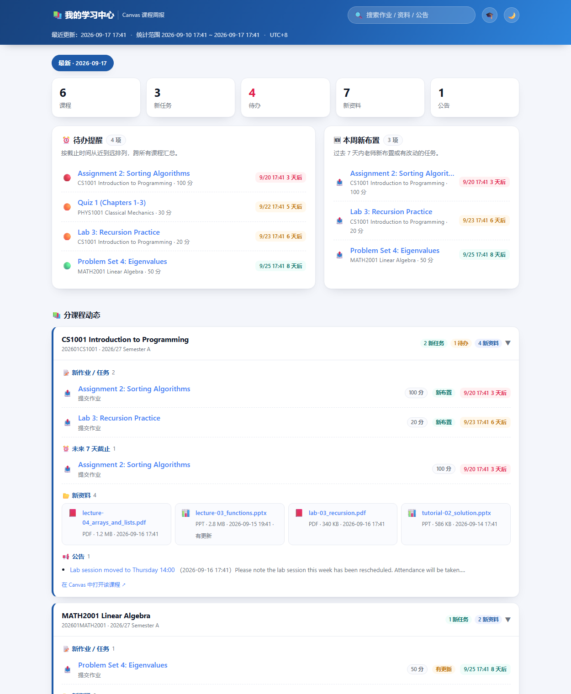
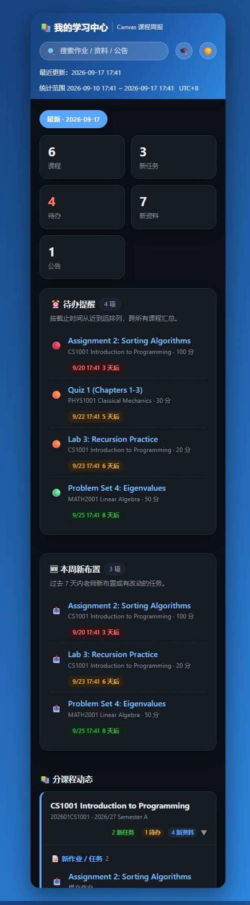

# Canvas Weekly Hub 🎓

[](https://github.com/Famalhaut04/canvas-weekly-hub/stargazers)

**城大 Canvas 课程助手** —— 为**香港城市大学（CityU）学生**打造的全自动 Canvas 课程周报与学习看板，基于 [Canvas LMS](https://www.instructure.com/canvas) API，同样兼容其他使用 Canvas 的学校。

定时抓取你在 Canvas 上的全部课程动态：新作业、未提交任务、老师改的截止时间、新上传的 PPT、新公告，汇总成周报与一个属于你的学习看板。**算法公开，数据私有**——你的课程信息只留在你自己的电脑上，本仓库不含任何人的凭证与数据。

## 🚀 两种用法，按需选择

### 🌐 网页版（推荐 · 不需要任何计算机基础 · 手机可用）

**👉 点此打开：https://famalhaut04.github.io/canvas-weekly-hub/web/**

打开网页后会看到「三步完成」的引导窗口，跟着点就行——**全程只用鼠标，不用写代码、不用懂 GitHub**：

| 步骤 | 你要做的 | 耗时 |
|---|---|---|
| ❶ 获取小助手 | 点「🚀 一键部署我的小助手」→ 用**邮箱**注册/登录 Cloudflare → 点 **Create and Deploy** → 复制它给你的网址，粘贴回页面 | 约 2 分钟 |
| ❷ 绑定令牌 | 去 Canvas 网站生成一个"访问令牌"（账户 → 设置 → 页面底部 + 新访问令牌），粘贴进页面 → 点「测试连接」 | 约 1 分钟 |
| ❸ 生成看板 | 点「🚀 抓取并生成看板」→ 你的专属课程网站就出现了，可下载「我的学习网站.html」离线用 | 约 10 秒 |

之后你将拥有：

- ⏰ 所有作业的**截止时间倒计时**（未提交的红标提醒，最紧急的排最前）
- ✅ 哪些交了、哪些**还没交**，一眼可见
- 🔄 老师**改期 / 新评分 / 删作业**的变化提醒
- 📂 新上传的课件清单
- 📅 一键把截止日期**导入手机日历**（到点自动提醒，也可订阅链接永久自动更新）
- 💬 微信**每日提醒**（可选，每天 18:30 推送未来 7 天待办）
- 🌗 深色模式 · 🔍 跨周搜索 · 🗓 历史归档

❓ **卡住了？** 看页面里的「📖 手把手图文教程」——注册、部署、每个英文按钮都有对照说明。更完整的说明见 **[网页版使用指南](docs/网页版使用指南.md)**

### 🅰️ 如果有 AI agent，可以直接克隆仓库导入定时任务

```bash
git clone https://github.com/Famalhaut04/canvas-weekly-hub.git
```

按 **[部署指南](docs/部署指南.md)** 配置令牌，然后把每周定时任务导入你的 agent，之后每周五晚自动抓取并**用中文向你汇报**。
功能最全：可同时更新本地看板、备份到你的私有仓库、生成单文件看板与 ICS 日历。

> 没有桌面安装包：网页版已覆盖核心场景；如需「定时自动运行 + 课件自动下载到本地」的离线能力，
> 克隆仓库后按部署指南用 Windows 计划任务运行抓取脚本（需 Python）即可实现。

> 两种方式数据格式完全一致，随时可以互换。


## ✨ 功能

- ⏰ **待办提醒**：跨课程汇总所有带截止时间的任务，按紧急度排序并显示倒计时（今天／明天／N 天后）
- ✅ **提交状态**：自动识别每个任务"已提交 / 未提交 / 已评分"，未提交且快截止的一眼可见
- 🔄 **变化检测**：与上次快照对比，老师改期、新评分、删除/隐藏作业都能报出明细
- 📥 **课件自动下载**：新上传的 PPT/PDF 自动按课程归档到本地 `downloads/`，复习不用再手动逐个下载
- 📅 **ICS 日历导出**：截止时间一键导入手机日历，系统级提醒
- 🆕 **每周新布置**：过去 7 天老师新布置或有改动的任务，一眼看清要做什么
- 📚 **分课程动态**：新作业、新上传的 PPT/PDF 资料（带类型图标和大小）、新公告
- ⏳ **Token 到期提醒**：适配 CityU 90 天限制，剩 5 天自动在周报中预警
- 🗓 **周报归档**：数据每周自动累积，可切换查看历史任意一周
- 🔍 **跨周搜索**：按名称检索历史全部作业、资料、公告
- 🌗 **深色模式**：跟随系统，亦可手动切换
- 📄 **本地周报**：每次生成 markdown 文件存档，方便复习
- 📦 **单文件看板**：生成一个自包含的 HTML，双击即开，无需服务器、可拷到手机看
- 🤖 **AI 汇报**（方式 A）：配合 ZCode 自动化任务，每周五晚用中文向你汇报本周要点

## 🔧 工作原理

```
             每周定时触发（agent 定时任务 / Windows 计划任务）
                              │
                              ▼
                   canvas_weekly_report.py （同一个抓取引擎）
                              │ Canvas REST API（你的个人 Token，只存本地）
                              ▼
        ┌─────────────────────┼─────────────────────┬──────────────────┐
        ▼                     ▼                     ▼                  ▼
 reports/周报.md        看板 data.json        单文件看板 HTML      ICS 日历
 （本地存档）           （可选推送私有仓库备份）  （双击即开）        （导入手机）
                              │
                              ▼
                    学习看板：待办倒计时、提交状态、
                    变化检测、新资料、历史归档、跨周搜索
```

## 🏫 CityU 学生快速通道

- Canvas 地址已在示例配置中预填 `https://canvas.cityu.edu.hk`，生成令牌填入即可使用；
- CityU 的 API 令牌**最长有效期 90 天**，请在配置里填写到期日，程序会在**剩 5 天**时提醒你更换；
- 只想看本学期课程：把配置里的 `term_filter` 设为 `2026/27 Semester A`；
- 本项目只覆盖 Canvas，AIMS、校园邮箱等其他系统不在范围内。

## 📁 目录结构

```
canvas_weekly_report.py      # 抓取引擎：拉 Canvas 数据 → 周报 → 看板 → 日历（命令行）
site-template/index.html     # 学习看板首页模板（单文件，无构建依赖）
config/canvas_config.example.json   # 配置模板（Token 留空，由你自己填写）
config/data.template.json    # 看板初始空数据文件
docs/部署指南.md              # 方式 A：从零跑通的完整教程（含导入 agent 定时任务）
docs/screenshots/            # 界面截图
```

## 🖼 看板预览

> 以下截图为**虚构示例数据**（不含任何真实用户的课程信息）。

| 桌面 · 浅色 | 手机 · 深色 |
|---|---|
|  |  |

## ⚙️ 配置说明

`canvas_config.json`（由模板复制而来，**不会也不会被提交**）：

| 字段 | 说明 | 默认 |
|---|---|---|
| `canvas_url` | 你学校 Canvas 的地址，如 `https://canvas.cityu.edu.hk` | — |
| `access_token` | 你的 Canvas 个人访问令牌，**自行获取并填入** | 空 |
| `token_expires_at` | 你的 Token 到期日（`YYYY-MM-DD`，见令牌生成页），剩 5 天开始在周报中预警 | 空 |
| `token_remind_days` | Token 到期提前提醒天数 | 5 |
| `lookback_days` | 统计"过去几天"的新内容 | 7 |
| `upcoming_days` | 统计"未来几天"要截止的作业 | 7 |
| `tz_offset_hours` | 展示用时区偏移（小时） | 8（UTC+8） |
| `download_files` | 是否自动下载新课件到本地 | true |
| `download_dir` | 课件保存目录（相对工作目录） | downloads |
| `term_filter` | 只统计匹配该关键字的学期，留空 = 全部活跃课程 | 空 |
| `github.username` | 你的 GitHub 用户名 | — |
| `github.repo_name` | 你的看板数据仓库名 | learning-hub |
| `github.repo_dir` | 本机网站仓库的绝对路径 | — |
| `github.push_enabled` | 是否自动 commit + push 网站数据 | true |

## 🔐 安全与隐私（重要）

**算法公开，数据私有** —— 本仓库只有通用代码与模板，**不含任何使用者的课程数据**。每个人的课程信息都留在他自己的电脑和自己的仓库里：

| 内容 | 位置 | 可见性 |
|---|---|---|
| 脚本、页面模板、文档 | 本仓库（公开） | 所有人可见，随便分享 |
| `canvas_config.json`（含 Token） | 使用者本机 | 仅自己，`.gitignore` 已排除，不会入库 |
| 课程数据仓库 `learning-hub` | 使用者自己的 GitHub 仓库 | **可设为私有**，课程信息仅自己可见 |

- **完全不想公开网页？** 把网站仓库设为 Private（免费账号的 Pages 会随之停用），改为**本地看板**：在仓库目录运行 `python -m http.server 8137`，浏览器打开 `http://localhost:8137/`；同一 WiFi 下手机也能访问。周报脚本与数据更新不受影响，`git push` 仍可作为云端备份。详见[部署指南第 5 步](docs/部署指南.md)。
- **本仓库不包含任何人的 Canvas 凭证。** `canvas_config.json` 需由使用者自己创建并填入自己的 Token（从 `config/canvas_config.example.json` 复制）。
- Token 只保存在使用者本机，等同于账号凭证——不要提交、不要分享。若怀疑泄露，到 Canvas「账户 → 设置」删除该令牌即立即失效。
- 课程数据仓库里只有页面代码与课程任务摘要（作业名/截止时间/文件名），不含 Token，也不含作业正文。
- 不小心把 Token 提交进了某个仓库？立即吊销旧 Token，必要时删除该仓库重建。

## ❓ 常见问题

见 [docs/部署指南.md 第 9 节](docs/部署指南.md#9-常见问题排查)（401 认证失败、GH007 邮箱隐私拦截、CDN 缓存、本地打开无数据等）。

## 📢 更新公告

- **2026-09-20 · v2.0.0**：网页版正式上线，桌面版停止分发（详见 [更新公告](CHANGELOG.md)）

## 📄 许可证

[MIT](LICENSE)
